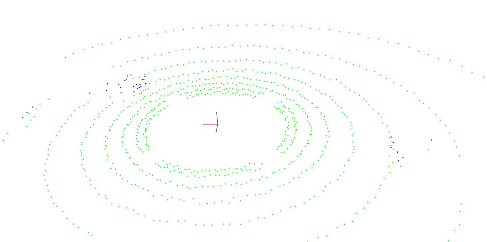
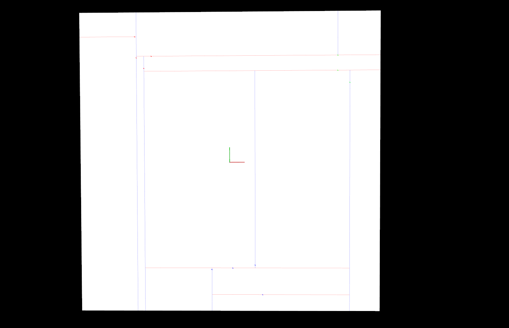

# Lidar Obstacle Detection

## Lidar Sensor

sensing gives us high resolution data by sending out thousands of laser signals. These lasers bounce off objects, returning to the sensor where we can then determine how far away objects are by timing how long it takes for the signal to return. Also we can tell a little bit about the object that was hit by measuring the intesity of the returned signal. Each laser ray is in the infrared spectrum, and is sent out at many different angles, usually in a 360 degree range. While lidar sensors gives us very high accurate models for the world around us in 3D, they are currently very expensive, upwards of $60,000 for a standard unit.

## Workflow

1. Segment the point cloud into plane (road) region and obstacle region using RANSAC.

* The RANSAC algorithm is a learning technique to estimate parameters of a model by random sampling of observed data. Given a dataset whose data elements contain both inliers and outliers, RANSAC uses the voting scheme to find the optimal fitting result. Data elements in the dataset are used to vote for one or multiple models. 

* The implementation of this voting scheme is based on two assumptions: that the noisy features will not vote consistently for any single model (few outliers) and there are enough features to agree on a good model (few missing data).

* We implement the 3D plane segmentation from scratch instead of PCL library using RANSAC algorithm and this can be found in in `src/processpointcloud.cpp` as well as 2D/3D Plane segment in `src/quiz/ransac2D.cpp`

Output for RANSAC froms scratch



2. KD- Tree implementation for cluster finding (nearest neighbors of points detected in obstacle cloud)

* A K-D Tree(also called as K-Dimensional Tree) is a binary search tree where data in each node is a K-Dimensional point in space. In short, it is a space partitioning(details below) data structure for organizing points in a K-Dimensional space.

* A non-leaf node in K-D tree divides the space into two parts, called as half-spaces.

* Points to the left of this space are represented by the left subtree of that node and points to the right of the space are represented by the right subtree. We will soon be explaining the concept on how the space is divided and tree is formed.

* The root would have an x-aligned plane, the root’s children would both have y-aligned planes, the root’s grandchildren would all have x-aligned planes, and the root’s great-grandchildren would all have y-aligned planes and so on.

* we implement 2D and 3D Kd-tree to find clusters from obstacle point cloud after segmenting the same from the plane cloud and this can be found in in `src/processpointcloud.cpp` as well as 2D/3D Plane segment in `src/quiz/ransac2D.cpp

Output of 2D- KD tree implementation from scratch



3. Bounding Box and Obstacle detection

* After segmenting the plane and obstacle cloud from raw point cloud and then appling KD- tree for finding nearest neighbors in the obstacle cloud to form a cluster, Next step is to make an approx bounding box around the found clusters. To check the implementation of bounding boxes, go to `src/render/box.h 

* We test the whole work flow on two poind cloud pcd files provided in `src/sensors/data/pcd`

Output from pcd/data_1:


Output from pcd/data_2:


* We can compare results with existing PCL library for RANSAC and Clustering with our implementation from scratch.

##### We can use carla simulator or similar to extract raw lidar data points and covert to pcd. In this way we can test the implemented algorithm on different datasets and compare the results. 

## Installation

### Ubuntu 

```bash
$> sudo apt install libpcl-dev
$> cd ~
$> git clone https://github.com/aditya-167/Lidar-Obstacle-Detection-PCL.git
$> cd Lidar-Obstacle-Detection-PCL
$> mkdir build && cd build
$> cmake ..
$> make
$> ./environment
```

### Windows 

http://www.pointclouds.org/downloads/windows.html

### MAC

#### Install via Homebrew
1. install [homebrew](https://brew.sh/)
2. update homebrew 
	```bash
	$> brew update
	```
3. add  homebrew science [tap](https://docs.brew.sh/Taps) 
	```bash
	$> brew tap brewsci/science
	```
4. view pcl install options
	```bash
	$> brew options pcl
	```
5. install PCL 
	```bash
	$> brew install pcl
	```

#### Prebuilt Binaries via Universal Installer
http://www.pointclouds.org/downloads/macosx.html  
NOTE: very old version 

#### Build from Source

[PCL Source Github](https://github.com/PointCloudLibrary/pcl)

[PCL Mac Compilation Docs](http://www.pointclouds.org/documentation/tutorials/compiling_pcl_macosx.php)
